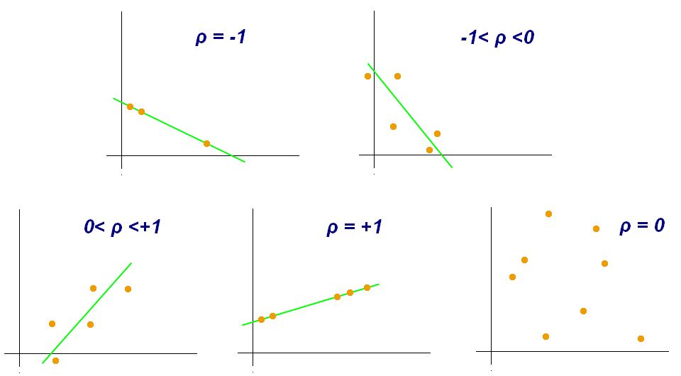
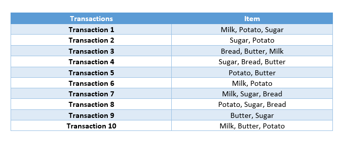
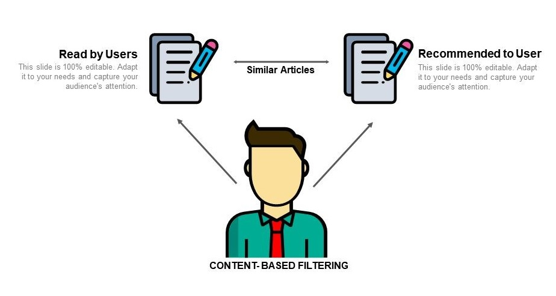

# **Overview of Recommender Systems And Implementations**

## **1-INTRODUCTION**

Recommender system: an information-filtering system supporting the user in a given decision making situation by narrowing the set of possible options and prioritizing its elements in a specific context. Prioritization can be based on the user's explicitly or implicitly expressed preferences and also on the previous behavior of users with similar preferences.

**HISTORY OF RECOMMENDER SYSTEMS**

Recommender systems were first mentioned in a technical report as a "digital bookshelf" in 1990 by Jussi Karlgren at Columbia University and implemented at scale and worked through in technical reports and publications from 1994 onwards by Jussi Karlgren, then at SICS and research groups led by Pattie Maes at MIT, Will Hill at Bellcore and Paul Resnick, also at MIT whose work with GroupLens was awarded the 2010 ACM Software Systems Award.

Montaner provided the first overview of recommender systems from an intelligent agent perspective. Adomavicius provided a new, alternate overview of recommender systems. Herlocker provides an additional overview of evaluation techniques for recommender systems, and Beel et al. discussed the problems of offline evaluations.Beel et al. have also provided literature surveys on available research paper recommender systems and existing challenges.

**The Netflix Prize**

The Netflix Prize was an open competition for the best collaborative filtering algorithm to predict user ratings for films, based on previous ratings without any other information about the users or films, i.e. without the users or the films being identified except by numbers assigned for the contest.

The competition was held by Netflix, an online DVD-rental and video streaming service, and was open to anyone who is neither connected with Netflix (current and former employees, agents, close relatives of Netflix employees, etc.) nor a resident of certain blocked countries (such as Cuba or North Korea). On September 21, 2009, the grand prize of US$1,000,000 was given to the BellKor's Pragmatic Chaos team which bested Netflix's own algorithm for predicting ratings by 10.06%.

Netflix provided a training data set of 100,480,507 ratings that 480,189 users gave to 17,770 movies. Each training rating is a quadruplet of the form <user, movie, date of grade, grade>. The user and movie fields are integer IDs, while grades are from 1 to 5 (integral) stars.

The qualifying data set contains over 2,817,131 triplets of the form <user, movie, date of grade>, with grades known only to the jury. A participating team's algorithm must predict grades on the entire qualifying set, but they are only informed of the score for half of the data, the quiz set of 1,408,342 ratings. The other half is the test set of 1,408,789, and performance on this is used by the jury to determine potential prize winners. Only the judges know which ratings are in the quiz set, and which are in the test set - this arrangement is intended to make it difficult to hill climb on the test set. Submitted predictions are scored against the true grades in terms of root mean squared error (RMSE), and the goal is to reduce this error as much as possible. Note that while the actual grades are integers in the range 1 to 5, submitted predictions need not be. Netflix also identified a probe subset of 1,408,395 ratings within the training data set. The probe, quiz, and test data sets were chosen to have similar statistical properties.

In summary, the data used in the Netflix Prize looks as follows:

*Training set* (99,072,112 ratings not including the probe set, 100,480,507 including the probe set) 

*Probe set* (1,408,395 ratings)

Qualifying set (2,817,131 ratings) consisting of:

*Test set* (1,408,789 ratings), used to determine winners 

*Quiz set* (1,408,342 ratings), used to calculate leaderboard scores

For each movie, title and year of release are provided in a separate dataset. No information at all is provided about users. In order to protect the privacy of customers, "some of the rating data for some customers in the training and qualifying sets have been deliberately perturbed in one or more of the following ways: deleting ratings; inserting alternative ratings and dates; and modifying rating dates".

The training set is such that the average user rated over 200 movies, and the average movie was rated by over 5000 users. But there is wide variance in the data - some movies in the training set have as few as 3 ratings,[4] while one user rated over 17,000 movies.

There was some controversy as to the choice of RMSE as the defining metric. Would a reduction of the RMSE by 10% really benefit the users? It has been claimed that even as small an improvement as 1% RMSE results in a significant difference in the ranking of the "top-10" most recommended movies for a user.

The joint-team "BellKor's Pragmatic Chaos" consisted of two Austrian researchers from Commendo Research & Consulting GmbH, Andreas Töscher and Michael Jahrer (originally team BigChaos), two researchers from AT&T Labs, Robert Bell, and Chris Volinsky, Yehuda Koren from Yahoo! (originally team BellKor) and two researchers from Pragmatic Theory, Martin Piotte and Martin Chabbert.As required, they published a description of their algorithm.

**SIMILARITIES/DISTANCES BETWEEN ITEMS**

*Similarity Based Metrics:*

- Pearson's correlation
- Spearman's correlation
- Kendall's Tau
- Cosine similarity
- Jaccard similarity

*Distance Based Metrics:*

- Euclidean distance
- Manhattan distance
- Cosine similarity

**COSINE SIMILARITY**

Cosine similarity measures the similarity between two vectors of an inner product space. It is measured by the cosine of the angle between two vectors and determines whether two vectors are pointing in roughly the same direction.

*Formula:*

**EUCLIDEAN DISTANCE**

The Euclidean distance between two points in either the plane or 3-dimensional space measures the length of a segment connecting the two points. It is the most obvious way of representing distance between two points.

*Formula (for 2 dimensions) :*

**PEARSON CORRELATION**

Similar to the modified Euclidean Distance, a Pearson Correlation Coefficient of 1 indicates that the data objects are perfectly correlated but in this case, a score of -1 means that the data objects are not correlated. In other words, the Pearson Correlation score quantifies how well two data objects fit a line.

Formula:

## **2-METHODS**

**2.1-POPULARITY BASED**

It is a type of recommendation system which works on the principle of popularity and or anything which is in trend. These systems check about the product or movie which are in trend or are most popular among the users and directly recommend those.

For example, if a product is often purchased by most people then the system will get to know that that product is most popular so for every new user who just signed it, the system will recommend that product to that user also and chances becomes high that the new user will also purchase that.

*Merits of popularity based recommendation system*

- It does not suffer from cold start problems which means on day 1 of the business also it can recommend products on various different filters.
- There is no need for the user's historical data.

*Demerits of popularity based recommendation system*

- Not personalized
- The system would recommend the same sort of products/movies which are solely based upon popularity to every other user.

It works with the idea that if you determine the ones that show the most interest, they will be followed anyway.

**2.2- ASSOCIATION RULE LEARNING MODEL**

It is a rule-based machine learning technique used to find patterns (pattern, relationship, structure) in data.

**Apriori Algorithm**

Apriori is an algorithm for frequent item set mining and association rule learning over relational databases. It proceeds by identifying the frequent individual items in the database and extending them to larger and larger item sets as long as those item sets appear sufficiently often in the database.

The frequent item sets determined by Apriori can be used to determine association rules which highlight general trends in the database: this has applications in domains such as market basket analysis.

*Pros:*

- Simple algorithm
- Easy to implement on large itemsets in large databases using Joint and prune steps

*Cons:*

- It requires high computation if the item sets are very large and the minimum support is kept very low
- The algorithm scans the database too many times, which reduces the overall performance
- Time and space complexity of this algorithm is very high

It has an iterative working principle. Firstly, the products with 2 will be looked at, then with 3 etc. Those who pass the support value, that is, the threshold value, will go to the last stage.

As an example, I will identify 2 products and calculate the support, confidence and lift values of these products.

*Example for Milk and Sugar:*

Calculate the probability of milk and sugar appearing alone.

*Support(Milk)* = 5/10

*Support(Sugar)* = 6/10

Calculate the probability that milk and sugar will appear together.

*Support(Milk,Sugar)* = 2/10

Probability of selling Y when X is bought

*Confidence(Milk,Sugar)* = 2/5

*Lift* = 2/10 / ((5/10)*(6/10)) = 0,66

When milk is purchased, the probability of buying sugar increases 0.66 times.

When one of the products that lift each other well is sold more appropriately, it increases the probability of purchase when the other increases the probability of purchase.

**Methods To Improve Apriori Efficiency**

Many methods are available for improving the efficiency of the algorithm.

*Hash-Based Technique:* This method uses a hash-based structure called a hash table for generating the k-itemsets and its corresponding count. It uses a hash function for generating the table.

*Transaction Reduction:* This method reduces the number of transactions scanning in iterations. The transactions which do not contain frequent items are marked or removed.

*Partitioning:* This method requires only two database scans to mine the frequent itemsets. It says that for any itemset to be potentially frequent in the database, it should be frequent in at least one of the partitions of the database.

*Sampling:* This method picks a random sample S from Database D and then searches for frequent itemset in S. It may be possible to lose a global frequent itemset. This can be reduced by lowering the min_sup.

*Dynamic Itemset Counting:* This technique can add new candidate itemsets at any marked start point of the database during the scanning of the database.

**2.3-CONTENT BASED MODEL**

Content-based filtering uses item features to recommend other items similar to what the user likes, based on their previous actions or explicit feedback.

To demonstrate content-based filtering, let's hand-engineer some features for the Google Play store. The following figure shows a feature matrix where each row represents an app and each column represents a feature. Features could include categories (such as Education, Casual, Health), the publisher of the app, and many others. To simplify, assume this feature matrix is binary: a non-zero value means the app has that feature.

You also represent the user in the same feature space. Some of the user-related features could be explicitly provided by the user. For example, a user selects "Entertainment apps" in their profile. Other features can be implicit, based on the apps they have previously installed. For example, the user installed another app published by Science R Us.

The model should recommend items relevant to this user. To do so, you must first pick a similarity metric (for example, dot product). Then, you must set up the system to score each candidate item according to this similarity metric. Note that the recommendations are specific to this user, as the model did not use any information about other users.

- Count Vector (Word Count) Method
- TF-IDF Method

**Count Vector (Word Count) Method**

Distance/similarity is calculated based on movies in rows, unique words describing movies in columns, and matching values in the table.

*Example:*

** Calculation will be explained in the implementation part

**TF-IDF Method**

In information retrieval, tf–idf, TF*IDF, or TFIDF, short for term frequency–inverse document frequency, is a numerical statistic that is intended to reflect how important a word is to a document in a collection or corpus. It is often used as a weighting factor in searches of information retrieval, text mining, and user modeling. The tf–idf value increases proportionally to the number of times a word appears in the document and is offset by the number of documents in the corpus that contain the word, which helps to adjust for the fact that some words appear more frequently in general. tf–idf is one of the most popular term-weighting schemes today. A survey conducted in 2015 showed that 83% of text-based recommender systems in digital libraries use tf–idf.

Variations of the tf–idf weighting scheme are often used by search engines as a central tool in scoring and ranking a document's relevance given a user query. tf–idf can be successfully used for stop-words filtering in various subject fields, including text summarization and classification.

One of the simplest ranking functions is computed by summing the tf–idf for each query term; many more sophisticated ranking functions are variants of this simple model.

- STEP 1: TF(w) (term frequency) = (Frequency of occurrence of a w term in the relevant document) / (Total number of terms in the document)
- STEP 2: IDF(w) (inverse document frequency) = 1 + ln ((Total number of documents + 1) / (Number of documents with w term in it + 1)
- STEP 3: TF-IDF = TF(w) * IDF(w)
- STEP 4: L2 normalization to TF-IDF Values.

**Term Frequency (TF)**

It is a measure of the frequency of a word (w) in a document (d). TF is defined as the ratio of a word's occurrence in a document to the total number of words in a document. The denominator term in the formula is to normalize since all the corpus documents are of different lengths.

**Inverse Document Frequency (IDF)**

It is the measure of the importance of a word. Term frequency (TF) does not consider the importance of words. Some words such as' of', 'and', etc. can be most frequently present but are of little significance. IDF provides weightage to each word based on its frequency in the corpus D.

**L2 Normalization**

The notation for the L2 norm of a vector is ||v||2 where 2 is a subscript. … As such, it is also known as the Euclidean norm as it is calculated as the Euclidean distance from the origin. The result is a positive distance value. The L2 norm is calculated as the square root of the sum of the squared vector values

*Example:*

**2.4- ITEM-BASED COLLABORATIVE FILTERING MODEL**

Item-item collaborative filtering, or item-based, or item-to-item, is a form of collaborative filtering for recommender systems based on the similarity between items calculated using people's ratings of those items. Item-item collaborative filtering was invented and used by Amazon.com in 1998. It was first published in an academic conference in 2001.

Earlier collaborative filtering systems based on rating similarity between users (known as user-user collaborative filtering) had several problems:

- systems performed poorly when they had many items but comparatively few ratings
- computing similarities between all pairs of users was expensive
- user profiles changed quickly and the entire system model had to be recomputed

Item-item models resolve these problems in systems that have more users than items. Item-item models use rating distributions per item, not per user. With more users than items, each item tends to have more ratings than each user, so an item's average rating usually doesn't change quickly. This leads to more stable rating distributions in the model, so the model doesn't have to be rebuilt as often. When users consume and then rate an item, that item's similar items are picked from the existing system model and added to the user's recommendations.

In the table above, the ratings given by the users to the movies are given. What is the most similar ratings given film with Movie 2? We can see that the movie is n. This relationship can catch them in the form of correlation-based or distance-based. As of first stage, we will prefer correlation because it captures the relationship distribution and is a measure of similarity.

The second stage involves executing a recommendation system. It uses the items (already rated by the user) that are most similar to the missing item to generate rating. We hence try to generate predictions based on the ratings of similar products. We compute this using a formula which computes rating for a particular item using weighted sum of the ratings of the other similar products.

**2.5-USER-BASED COLLABORATIVE FILTERING MODEL**

User based collaborative filtering uses that logic and recommends items by finding similar users to the active user.

Similarity for any two users 'a' and 'b' can be calculated from the given formula:

The target user might be very similar to some users and may not be much similar to the others. Hence, the ratings given to a particular item by the more similar users should be given more weightage than those given by less similar users and so on. This problem can be solved by using a weighted average approach. In this approach, you multiply the rating of each user with a similarity factor calculated using the above mention formula. The missing rating can be calculated as:

**2.6 HYBRID MODEL**

It can be used as parallel or sequential compilation of content based and collaborative filtering methods. There is no fixed method. It can be designed according to the wishes of the person who will analyze and the needs of the company.

**2.7-MODEL BASED**

**Matrix factorization**

Matrix factorization is a class of collaborative filtering algorithms used in recommender systems. Matrix factorization algorithms work by decomposing the user-item interaction matrix into the product of two lower dimensionality rectangular matrices. This family of methods became widely known during the Netflix prize challenge due to its effectiveness as reported by Simon Funk in his 2006 blog pos where he shared his findings with the research community. The prediction results can be improved by assigning different regularization weights to the latent factors based on items' popularity and users' activeness.

To fill in the blanks, the weights of the latent features that are assumed to exist for users and movies are found over the existing data, and predictions are made for non-existent observations with these weights.

It decomposes the User-Item matrix into 2 less dimensional matrices.

It assumes that the transition from the 2 matrices it parses to the User-Item matrix occurs with latent factors.

The weights of the latent factors are found on the filled observations.

We have a user-movie matrix, at the intersection of which there are ratings.

The method assumption says that there are some hidden factors for users as well as for movies.

For example, there are hidden factors that we have not observed yet that affect the user's liking for a movie. The same factors have their counterparts in the moviesFor example, whether or not Brad Pitt is in the movie or whether the movie is an adventure movie or not. In fact, the user makes a movie selection based on these latent factors.

In other words, the formula says that the value of the rating matrix and the transpose of the item vector are subtracted from the rating matrix with the user vector multiplied, their squares are taken, and the lowest q and p values of the error are reached by summing after a correction process to avoid over-learning.

So, when you look at all the data and consider all the users, what are the weights of these latent features (100 or 1000) in terms of users and what are the weights of latent features in terms of all movies. Using them, it fills in the empty ones.

It is assumed that the rating matrix is formed by the product of two factor matrices (dot product).

Factor matrices →user latent factors and movie latent factors

Latent factors or Latent features →Latent factors or variables.

Users and movies are considered to have scores for latent features.

These weights (scores) are found on the existing data and then the empty sections are filled according to these weights.

The table on the left shows the ratings given by the users for the movies.

In the middle table, the effect of F1 and F2 (for example, having a famous movie star) on the user side for each user is measured with p

In the table on the right, the effect of each latent factor (for example, a famous movie star or genre) on the films side is measured with q values.

All p and q's are found iteratively over the existing values and then used.

Initially, random p and q values and the values in the rating matrix are tried to be estimated.

In each iteration, erroneous predictions are arranged to try to approach the values in the rating matrix. As the iterations change, the weights will change until the given actual rating is reached.

For example, if 5 is called 3 in one iteration, then 4 is called in the next iteration, and 5 is called in the last iteration.

When we want to estimate the M3 movie rating for the U1 user, we do matrix multiplication.

So for M3; 0.8 *0.1 + 0.5* 4.2 = 2.18 à u1 user's estimated score for m3 movie In this way all the blanks are filled.

*Note:*

We said It decomposes the User-Item matrix into 2 less dimensional matrices for matrix factorization. SVD does this with 3 matrices.

**3-COLD START PROBLEM**

Cold start is a potential problem in computer-based information systems which involves a degree of automated data modelling. Specifically, it concerns the issue that the system cannot draw any inferences for users or items about which it has not yet gathered sufficient information.

There are three cases of cold start:

*New community:* refers to the start-up of the recommender, when, although a catalogue of items might exist, almost no users are present and the lack of user interaction makes it very hard to provide reliable recommendations

*New item:* a new item is added to the system, it might have some content information but no interactions are present

*New user:* a new user registers and has not provided any interaction yet, therefore it is not possible to provide personalized recommendations

Such problems can be solved in several ways according to the firm's strategy. It is not possible for us to make a data-based recommendation for a completely new user. In this case, if we do not have any information about the user, we can make a popularity-based recommendation. Or if he/she searched for a specific product, we can make a content-based suggestion similar to this product.

**4-CONCLUSION**

Recommender systems have many methods that can be used according to needs. Recommendation systems is a field still open to improvement. In this article, I tried to include almost all of the methods of recommendation systems. It should be noted that this is a review article. Each method has its own advantages and disadvantages. You can find detailed information about the methods you need look at references section. I hope the information will be useful to you. Thank you for your time.

**Data Sets Informations:**

**MovieLens:**

**Download:**  https://grouplens.org/datasets/movielens/

**tag.csv** that contains tags applied to movies by users:

- **userId** : a unique identifier of the user who made the rating
- **movieId **: a unique identifier of the rated movie
- **tag** : the user's tagged evaluation of the movie
- **timestamp **: the number of seconds since 0:00 on January 1, 1970 until the user submits the evaluation

**rating.csv** that contains ratings of movies by users:

- **userId **: a unique identifier of the user who made the rating
- **movieId** : a unique identifier of the rated movie
- **rating **: user rating, which is a 5-star system, in increments of half a star (0.5 stars-5 stars)
- **timestamp** : the number of seconds since 0:00 on January 1, 1970 until the user submits the evaluation

**movie.csv** that contains movie information:

- **movieId** : a unique identifier of the rated movie
- **title** : the title of the rated movie with the release year in parentheses
- **genres** : a sequence of genres to which the rated movie belongs

**link.csv** that contains identifiers that can be used to link to other sources:

- **movieId**  : a unique identifier of the rated movie
- **imdbId** : indicates the id of this movie on imdb
- **tmbdId** : represents the id of this movie on themoviedb

**genome_scores.csv** that contains movie-tag relevance data:

- **movieId **: a unique identifier of the rated movie
- **tagId** : the id of user's tagged evaluation of the movie 
- **relevance**

**genome_tags.csv** that contains tag descriptions:

- **tagId** : the id of user's tagged evaluation of the movie 
- **tag** : the user's tagged evaluation of the movie

**The Movie Dataset**

**Download** : https://www.kaggle.com/stefanoleone992/imdb-extensive-dataset

**movies_metadata.csv:** The main Movies Metadata file. Contains information on 45,000 movies featured in the Full MovieLens dataset. Features include posters, backdrops, budget, revenue, release dates, languages, production countries and companies.

**keywords.csv:** Contains the movie plot keywords for MovieLens movies

**credits.csv:** Consists of Cast and Crew Information for all movies.

**links.csv:** The file that contains the TMDB and IMDB IDs of all the movies featured in the Full MovieLens dataset.

**links_small.csv:** Contains the TMDB and IMDB IDs of a small subset of 9,000 movies of the Full Dataset.

**ratings_small.csv:** The subset of 100,000 ratings from 700 users on 9,000 movies

**REFERENCES**

www.veribilimiokulu.com

https://onespire.hu/sap-news-en/history-of-recommender-systems/

https://en.wikipedia.org/wiki/Recommender_system

https://en.wikipedia.org/wiki/Netflix_Prize

https://towardsdatascience.com/calculate-similarity-the-most-relevant-metrics-in-a-nutshell-9a43564f533e

https://www.analyticssteps.com/blogs/what-are-recommendation-systems-machine-learning

https://en.wikipedia.org/wiki/Apriori_algorithm

https://www.softwaretestinghelp.com/apriori-algorithm/

https://developers.google.com/machine-learning/recommendation/content-based/basics

https://en.wikipedia.org/wiki/Item-item_collaborative_filtering

https://www.geeksforgeeks.org/user-based-collaborative-filtering/

https://www.mygreatlearning.com/blog/apriori-algorithm-explained/
